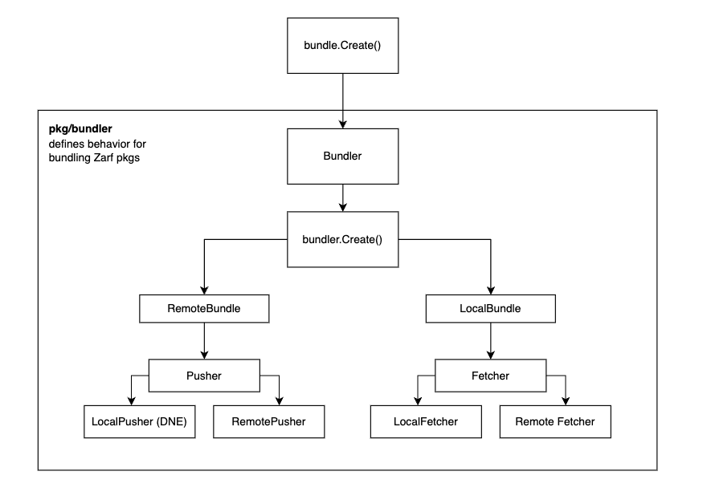

# 3. Architecting Bundle Create Operations

Date: 8 Feb 2024

## Status
Accepted

## Context
The primary feature of UDS CLI is to support the bundling and deployment of multiple Zarf packages as a single artifact, called a UDS Bundle. Specifically, the following artifact types need to be supported:

- Local tarballed Bundle composed of local and remote Zarf Packages
- Remote OCI Bundle composed of local and remote Zarf Packages

To the greatest extent possible, the team has ensured that local bundles and remote bundles are identical in terms of their contents and structure as OCI artifacts. This opinionation has led to messy code that is difficult to maintain and extend, particularly when creating Bundles. The purpose of this ADR is to propose a new architecture for creating Bundles.

### Proposed Architecture

Calling `bundle.Create` will result in the creation of a `Bundler` object, which will be responsible for creating the Bundle. The `Bundler` then creates a `RemoteBundle` or `LocalBundle` object, depending on the options passed to the `Bundler`:

- A `RemoteBundle` contains a `Pusher` object, which is responsible for pushing both local and remote Zarf packages to a remote bundle.
- A `LocalBundle` contains a `Fetcher` object, which is responsible for fetching both local and remote Zarf packages and bringing them into a local Bundle.

Finally, `Pushers` and `Fetchers` both contain generic interfaces for pushing and fetching local and remote Zarf packages, respectively.

## Decision
UDS CLI will adopt the proposed architecture for creating Bundles. The team believes that this architecture will make maintaining and extending the majority of codebase's OCI-related code simpler.

## Consequences
The UDS CLI team will need to:
- Refactor the existing codebase to adopt the new architecture
- Recognize that any architecture is imperfect and will require changes as the product evolves; as a result, this document must be maintained to provide context for future decisions and contributors.
