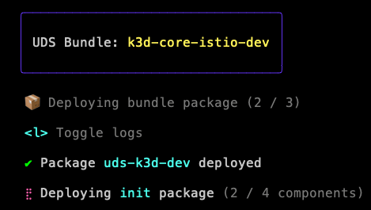

# 4. Terminal User Interface (TUI)

Date: 22 March 2024

## Status
Accepted

## Context
- Today, UDS CLI leverages the `pterm` library and `messaging` pkg in Zarf to provide a terminal user interface (TUI) for  users. The TUI is used to display progress bars, tables, etc to the user. The current implementation of the TUI is tightly coupled with Zarf, making it difficult to customize and address the unique needs of UDS CLI.

- The UDS CLI team has formed the following hypothesis about UDS CLI users: UDS CLI users (particularly those doing `uds deploy`) are more interested in the status of their deployment than the details of the deployment process.

- In an effort to address the unique needs of UDS CLI users, the UDS CLI team would like to decouple UDS CLI from the Zarf TUI in an effort to make a custom user experience for UDS CLI users.

## Decision
The UDS CLI team has decided to refactor the existing TUI implementation with [BubbleTea](https://github.com/charmbracelet/bubbletea) and other tools from the [Charm](https://charm.sh/) stack. We believe the Charm stack offers the most advanced and modern tooling for building TUIs in Go.

## Consequences
This refactor is large and will be implemented one `uds` operation at time, starting with operations most likely to be performed during and after bundle installation.

# Amendment 1

Date: 20 May 2024

## Status

Accepted

## Context

After experimenting with BubbleTea for a few months and creating a prototype for `uds deploy`, the team has decided to revert back to using the Zarf TUI. Our original assumption was that the simplified (and beautiful!) TUI would make our downstream users' lives easier, but this has been invalidated. Turns out, most if not all downstream users are using UDS CLI in a CI environment and/or inside a Maru task, which is incompatible with BubbleTea (noting that it may be possible to make BubbleTea look better in CI but the output just isn't helpful).

### Example
For historical context, here is a screenshot of the BubbleTea TUI:  

### Technical Problems
Although the basis for this amendment was user feedback, it's helpful to also note technical issues with BubbleTea that we encountered:
- If BubbleTea panics, this is a chance that the terminal will be left in a bad state. The team attempted to get around this issue by introducing a panic handler that called `reset` before exiting the program, but this solution felt hacky and was heavy-handed. Also, this is potentially disastrous if invoked in a regulated/classified environment where terminals aren't standard.
- Dev'ing was cumbersome because for any change to the TUI code (even things like color changes), the entire program had to be re-compiled, which is very slow.
- There isn't a great way to test the TUI. Although the Charm team has an experimental testing lib, it's not very mature and the team found it difficult to use. We did find ways to test the TUI but it didn't inspire as much confidence as we would have liked.

## Decision
- The UDS CLI team will revert back to using the Zarf TUI by removing the BubbleTea TUI code.
- We have decided to keep the `uds logs` feature for now because we believe it still provides value
- Potentially in the future, we will evaluate other scroll-based (non-interactive) TUI approaches
