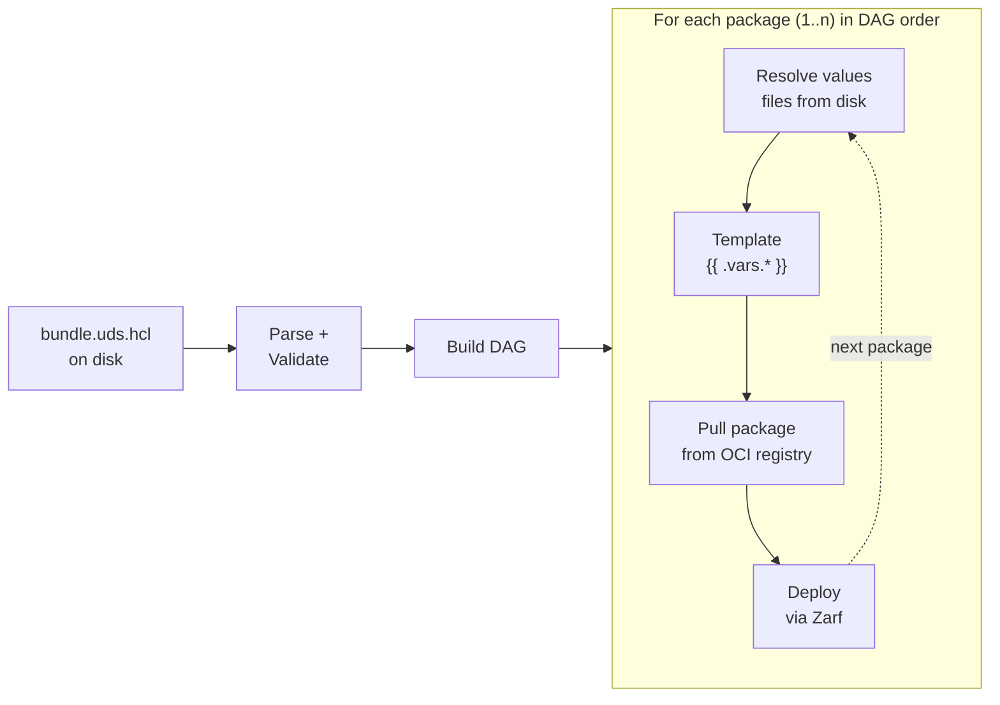
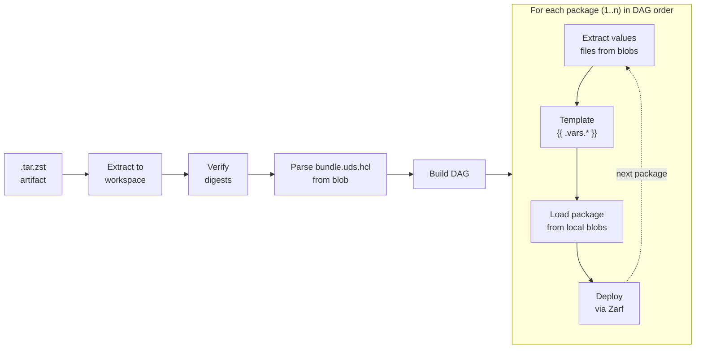

# 9. Bundle Deploy from Artifact

Date: 2026-04-07
Updated: 2026-05-22

## Changelog

| Date | Change |
|------|--------|
| 2026-04-07 | Initial ADR - artifact extraction, digest verification, values file handling, `PackageLoader` interface, config resolution for artifact deploy |
| 2026-05-22 | Renamed `PackageLoader` → `PackageLayoutLoader`, `OCIPackageLoader` → `SourcePackageLayoutLoader`, `LocalPackageLoader` → `ExtractedArtifactPackageLayoutLoader`; removed `cfg` parameter from loader interface; updated orchestration entry point to `PrepareDeploySource()` / `DeployOptions.Source` |

## Status

Accepted. The Testing Strategy section uses the term "Integration Tests" for tests that require a live cluster. [ADR-0014](0014-integration-test-tiers.md) formalises this into distinct tiers: digest-verification and values-extraction tests belong to the Library Integration tier (`library` tag); end-to-end artifact deploy against a cluster belongs to the On-Cluster Integration tier (`cluster_integration` tag, not yet implemented).

## Context

Today, `uds bundle deploy` only works against a source directory containing `bundle.uds.hcl` and the referenced values files on disk. Each package is pulled live from its OCI registry source at deploy time. This means:

- The user must have the original source tree available at deploy time.
- Package sources must be reachable from the deployment environment.
- There is no way to deploy a self-contained, pre-built artifact - the exact thing `uds bundle create` produces.

The bundle artifact (`.tar.zst`) is an OCI image layout containing all Zarf packages as OCI manifests plus a **bundle definition manifest** ([ADR-0007](0007-bundle-definition-and-value-files-in-oci-layout.md)) that carries `bundle.uds.hcl`, `defaults.uds.hcl`, and all values files as content-addressed layers. Everything needed to deploy is already inside the artifact.

### Scope and Intent

Direct deploy from the CLI (`uds bundle deploy`) - whether from a source directory or artifact - is intended for **development, testing, and CI workflows**. For actual mission/production environments, deployment should go through the **tofu provider** (cloud/data center) or **remote agent** (fleet), which offer state management, coordination, and operational capabilities appropriate for those environments.

The direct deploy capability provides a simplified way to:

- **Develop bundles**: Iterate on bundle definitions and validate they deploy correctly.
- **Test bundles**: Run automated tests in CI that create and deploy bundles against ephemeral clusters.
- **Debug issues**: Quickly deploy a specific artifact to reproduce and investigate problems.

This scope is intentionally limited. Features like deployment state tracking, rollback, drift detection, and concurrent deploy coordination are not provided - those concerns belong to the provider/agent layer. This naturally steers users toward the appropriate deployment mechanism for their environment.

### Goals

1. **Deploy from local tarball**: `uds bundle deploy uds-bundle-*.tar.zst`
1. **Default config**: When no `--config` is provided, deploy using the default config file (`defaults.uds.hcl`) and values baked into the artifact.
1. **Config override**: When `--config` is provided at deploy time, merge those variables on top of the defaults.
1. **Artifact digest verification**: Verify that the artifact's contents match their declared checksums before deploying.
1. **Design for OCI reference deploy** (future): `uds bundle deploy oci://ghcr.io/org/bundle:v1` (pull then deploy)
1. **Variable passthrough** (future): Design for making variables set during a package's deployment available to subsequent packages - without requiring explicit export declarations as in the old CLI - for both source-directory and artifact deploys.
1. **Deploy flags** (future): Design for `--resume`, `--retries`, `--packages`, and `--set`.

### Deploy Flows

#### Source Deploy (existing)



#### Artifact Deploy (new)



## Decision

### 1. Workspace Extraction

When the deploy target is a `.tar.zst` artifact, the CLI extracts it into a temporary workspace directory before deployment using the existing `extractTarZst()` function (which already has path traversal protection). The workspace mirrors the OCI layout produced by `create`:

```
<tmpdir>/uds-bundle-deploy-*/
    oci/
        oci-layout
        index.json
        blobs/sha256/
            <all blobs>
```

The workspace is cleaned up after deployment completes (or fails).

**Security note:** Extracting untrusted archives introduces attack surface - symlinks, decompression bombs, and a TOCTOU window between digest verification and deploy. `extractTarZst` delegates to Zarf's `archive.Decompress`, which anchors every filesystem operation in an `os.Root` (kernel-enforced path jail), rejects symlink and hardlink targets that escape the workspace, and rejects entry names containing backslash, colon, trailing dots or spaces, and Windows reserved device names. This covers path-traversal and link-injection vectors. Two hardening items remain tracked as follow-ups: (1) a decompression-bomb size cap - the underlying SDK currently exposes no hook for per-entry or total-extracted byte limits; (2) verify-at-read during the deploy phase to close the TOCTOU window between §3 digest verification and package load. The workspace directory is created with `0o700` permissions at every callsite, which blocks other local users but does not prevent the owning process from racing with itself on shared or network storage.

### 2. Bundle Definition Extraction

The bundle definition manifest is located in `index.json` by its `artifactType` (`application/vnd.defenseunicorns.uds.bundle.definition.v1`). From this manifest, we extract:

- **`bundle.uds.hcl`** - parsed to get the `UDSBundle` (package list, DAG, values, etc.)
- **`defaults.uds.hcl`** (if present) - parsed for default variables

All files are identified by their `org.opencontainers.image.title` annotation and read from `blobs/sha256/` by digest.

### 3. Artifact Digest Verification

The artifact's OCI layout provides a natural digest chain: `index.json` references manifest digests, each manifest references layer and config digests, and each blob file is named by its SHA-256 hex digest. This chain enables checksum verification - confirming that the artifact's contents match what was produced during `create`.

Note: This is **checksum verification**, not cryptographic signature verification. It detects corruption and unauthorized modification by comparing SHA-256 digests, but does not authenticate the artifact's origin. Signature-based verification (e.g., cosign/Sigstore) could be layered on in the future for stronger provenance guarantees.

Before deploying, the extracted workspace is verified by walking the full digest chain:

1. For each manifest entry in `index.json`, compute SHA-256 of the blob at `blobs/sha256/<hex>` and verify it matches the declared digest.
1. For each manifest, parse it and verify every layer and config blob: compute SHA-256 of each blob file and verify against the descriptor's digest. Verify size matches.
1. The first mismatch produces an error describing the specific blob, expected digest, and actual digest.

This verification is **always performed** - there is no opt-out flag. The artifact is expected to be immutable after `create`, and any modification indicates corruption or tampering. Users who want to modify bundle contents should rebuild from source.

### 4. Values File Handling

#### Current Create-Time Behavior

During `bundle create`, the referenced values files for each package are copied into the OCI layout as layers in the bundle definition manifest. Each file is stored under a positional path: `values/<package-name>/0.yaml`, `values/<package-name>/1.yaml`, etc. The index reflects the order of precedence when merging - `0.yaml` is the base, later files override earlier ones. The original filenames are not preserved in these layer paths, but they remain discoverable via the embedded `bundle.uds.hcl`.

#### Current Deploy-Time Behavior (source directory)

During `bundle deploy` from a source directory, the deployer processes each package's values files through the following pipeline:

1. Resolves each `values_files` path relative to the bundle directory.
1. Templates `{{ .vars.* }}` placeholders in each file individually using config variables, writing each rendered result to a separate temp file.
1. Passes the list of rendered file paths to Zarf's `value.ParseFiles`, which deep-merges them in order (later files override earlier ones).

#### Deploy-Time Behavior (artifact)

For artifact deploys, the same values pipeline is used. Values file layers are extracted from OCI blobs to disk in the workspace, then processed identically:

1. Walk the bundle definition manifest's layers, filtering by media type `application/vnd.defenseunicorns.uds.bundle.values.v1+yaml`.
1. For each values layer, read the blob from `blobs/sha256/<hex>` and write it to a workspace path matching the `org.opencontainers.image.title` annotation (e.g., `<workspace>/values/gitlab/0.yaml`).
1. Map extracted paths back to their package by parsing the `values/<package-name>/<index>.yaml` pattern.
1. Pass the extracted file paths through the existing values pipeline: resolve paths, template `{{ .vars.* }}` with config variables, parse with Zarf's `value.ParseFiles`.

#### Considered: Pre-Merged Values Files in Artifact

We considered merging values files at create time and storing a single pre-merged file per package (e.g., `values/<package-name>.yaml`) instead of the indexed multi-file approach. This would simplify the artifact structure and eliminate index-based ordering at deploy time.

**Advantages:**

- Simpler artifact structure - one values file per package instead of N.
- No index-based renaming or ordering logic needed at deploy time.
- The `<package-name>.yaml` naming convention provides a clear, self-documenting mapping between values files and packages.

**Trade-offs:**

- Requires a different deploy path for artifact vs source directory. Source-directory deploy still works with the original multi-file list (since files have not been merged). Artifact deploy uses the pre-merged single file. The `PackageLayoutLoader` abstraction (§5) could help here - the loader provides the values file path(s) alongside the package layout, and the deployer doesn't need to know which path produced them.
- Debugging is slightly harder - if a value is wrong, the user cannot tell which original file contributed it without looking at the source bundle definition. However, the merged file is deterministic (same inputs produce same output), so the source is always reproducible.

**Viability:**

This approach is **not viable with Go template expressions**. Values files containing `{{ .vars.* }}` templates are not valid YAML until after template resolution, which happens at deploy time (when config variables are known). A YAML deep-merge at create time would fail or produce incorrect results because the template expressions are not parseable as YAML. For example, merging a file containing `{{ .vars.key | toYaml | indent 2 }}` with another file touching the same key would break.

As such, the initial implementation uses the **indexed values file approach** (`values/<package-name>/0.yaml`, `1.yaml`, etc.), where each file is stored individually and the existing pipeline - template per-file, then merge via `value.ParseFiles` - is preserved for both source-directory and artifact deploys.

### 5. PackageLayoutLoader Interface

Currently, `ZarfDeployer.DeployPackage()` pulls each package from an OCI registry via `zoci.NewRemote()`. For artifact deploys, packages are already present as local blobs in the workspace.

To abstract this, a `PackageLayoutLoader` interface replaces the hard-coded OCI pull:

```go
type PackageLayoutLoader interface {
    LoadPackageLayout(ctx context.Context, pkg *Package, dstDir string) (*layout.PackageLayout, error)
}
```

Two implementations:

- **`SourcePackageLayoutLoader`**: Wraps the existing pull logic. Pulls from the OCI registry or local path, applies component filters, returns a `PackageLayout`. Used for source-directory deploys.
- **`ExtractedArtifactPackageLayoutLoader`**: Reads blobs from the extracted workspace's OCI layout. Given a package's manifest digest (resolved from `index.json` by `org.opencontainers.image.ref.name` annotation), it reads the manifest, walks its layers, copies each blob to the destination directory using `org.opencontainers.image.title` annotations to reconstruct the file tree, and returns a `PackageLayout`. Used for artifact deploys.

`PrepareDeploySource()` creates the appropriate loader based on whether the input is a `.tar.zst` artifact or a source directory, and passes it to `Deploy()` via `DeployOptions.Source`. The `ZarfDeployer` uses the loader without knowing the source of the blobs.

This design is intentionally cache-friendly - see §6.

### 6. Optimization: Shared Package Cache

Currently, source-directory deploys pull each Zarf package from an OCI registry into a temporary directory that is discarded after deployment. Artifact deploys extract packages from the workspace (which is itself a temp directory). In both cases, the package bytes are ephemeral - a subsequent `deploy` of the same bundle re-downloads or re-extracts the same packages.

A shared package cache would give both deploy paths a common, persistent location for Zarf packages. The `PackageLayoutLoader` interface (§5) makes this possible without changing the deployer.

#### How It Would Work

A `CachingPackageLayoutLoader` wraps either `SourcePackageLayoutLoader` or `ExtractedArtifactPackageLayoutLoader`:

1. **Cache key**: Each Zarf package in the bundle has a manifest digest (SHA-256) - either from the OCI registry (source-directory deploy) or from `index.json` in the artifact. This digest uniquely identifies the package contents.
1. **Cache lookup**: Before pulling or extracting, the `CachingPackageLayoutLoader` checks if a directory exists at `<cache-dir>/packages/<manifest-digest>/`. If it does and passes digest checks (see below), the cached path is returned directly - no download or extraction needed.
1. **Cache population**: On a cache miss, the wrapped loader (`SourcePackageLayoutLoader` or `ExtractedArtifactPackageLayoutLoader`) loads the package as normal. The result is then copied or linked into the cache directory for future use.
1. **Cache location**: Defaults to `~/.uds/cache/packages/`. Overridable via the `--uds-cache` CLI flag or `uds_cache` option in `config.uds.hcl` (already defined in ADR-0006 for this purpose). Same location regardless of deploy source. This is important for resource-constrained environments (air-gapped systems, shared runners, containers with limited storage) where the default location may not have sufficient disk space or the right access permissions.

#### Cache Digest Verification

Since the cache is a local directory that could be corrupted or modified, the `CachingPackageLayoutLoader` needs to verify cached packages before using them:

- **Digest-based verification**: The cache key is the package's manifest digest. On cache hit, the loader can re-hash the cached manifest file and compare it to the expected digest. If the manifest is intact, and the manifest's layer digests were verified when the cache was populated, the package is trustworthy. This is the same content-addressed checksum model used by the artifact digest verification (§3).
- **Size-based fast check**: For a quicker check (at the cost of weaker guarantees), the loader can verify that all blobs referenced by the cached manifest exist and have the expected sizes, without re-hashing. This catches truncated or missing files but not bit-level modification.
- **Full re-hash on demand**: A `--verify-cache` flag or `verify_cache` config option could trigger full SHA-256 re-hashing of all cached package blobs on read, providing the same level of checksum verification as the bundle artifact digest verification (§3). This specifically targets the package cache - bundle artifact verification (§3) is always performed and is separate. Full cache verification is expensive for large packages but available for environments where the local cache directory may not be trusted.

#### Cache Deduplication Between Artifact and Registry

When a user runs `create` (which pulls packages from registries) followed by `deploy` (from the resulting artifact), the same package blobs exist in two places: the artifact's OCI layout and potentially in the cache from the pull during create. The manifest digest serves as the deduplication key:

- If the artifact's package manifest digest matches a cached package's digest, they are identical - no copy needed. The deployer can use the cached version directly.
- If deploying from a source directory and the registry resolves to a manifest digest already in the cache, the download is skipped entirely.
- If the artifact contains a package at a different digest than what's in the cache (e.g., the bundle was built elsewhere), the cache entry is not replaced - both digests coexist. Cache cleanup (`uds cache clean`) handles eviction.

This means the cache naturally deduplicates across operations and deploy modes without explicit coordination. The manifest digest is the single source of truth for "is this the same package?"

This optimization is out of scope for the initial implementation but the `PackageLayoutLoader` interface is designed to accommodate it - a `CachingPackageLayoutLoader` can be added later by wrapping the existing loaders.

### 7. Config Resolution for Artifact Deploy

When deploying from an artifact, `defaults.uds.hcl` is inside the artifact rather than on disk next to the bundle. The config resolution flow adapts:

1. **`Complete()` (command layer)**: Resolve config with no bundle directory - skips `defaults.uds.hcl` disk lookup.
1. **`Run()` (command layer)**: Open artifact, extract `defaults.uds.hcl` from the bundle definition manifest, merge its variables as the lowest-priority layer.

The full precedence for artifact deploys:

```
Layer 1 (lowest):  Hardcoded defaults (architecture, log_level, etc.)
Layer 2:           defaults.uds.hcl from inside the artifact
Layer 3:           --config config.uds.hcl (user-provided at deploy time)
Layer 4 (highest): CLI flags (--architecture, --log-level, etc.)
```

When no `--config` is provided, the artifact deploys using its baked-in defaults alone. The `--config` flag is the primary mechanism for overriding both options and values at deploy time.

### 8. Deploy from OCI Reference (Future)

Deploying from an OCI reference (`oci://ghcr.io/org/bundle:v1`) composes the existing `Pull` operation with the artifact deploy:

```
oci://ghcr.io/org/bundle:v1
    -> Pull (already implemented) -> .tar.zst in temp dir
    -> Extract to workspace
    -> Deploy from workspace
```

This is a thin orchestration layer. With a `CachingPackageLayoutLoader` in place, `Pull` could also populate a shared cache, benefiting subsequent operations. Both the caching layer and the OCI deploy path are out of scope for this ADR but are accommodated by the `PackageLayoutLoader` interface design.

### 9. Updated CLI Surface

The `deploy` command accepts three forms:

```bash
# Source directory (existing)
uds bundle deploy [./path/to/bundle-dir]

# Local artifact (new)
uds bundle deploy uds-bundle-example-amd64-0.1.0.tar.zst

# OCI reference (future)
uds bundle deploy oci://ghcr.io/org/bundle:v1
```

Detection is by file extension (`.tar.zst`). The `ValidateBundlePath` function is updated to accept `.tar.zst` files (currently returns an error).

### 10. Potential Future Scope

The following features are documented here as potential enhancements, not commitments. They capture design thinking from this ADR's discussions and would apply to both source-directory and artifact deploys if pursued.

#### Variable Passthrough

Packages in a bundle may need to reference variables set by previously-deployed packages. For example, an `init` package may set a `REGISTRY_URL` variable that downstream packages need for image configuration, or a package could have a post-deploy action that sets a variable.

Zarf's `packager.Deploy()` already returns all variables that were set during a package's deployment - both variables set via input and variables set by Zarf actions. The deploy loop could capture these and make them available to subsequent packages in DAG order.

The old CLI required explicit `exports` declarations on each package to make variables available downstream. This added boilerplate without real safety - the set variables exist in Zarf's deploy result regardless of whether they are declared as exports. The design for UDS CLI Next should make all set variables from deployed packages implicitly available for reference, using HCL traversal syntax (e.g., `package.init.setVariables.REGISTRY_URL` or `package.init.setVariables.registry_url`) consistent with `depends_on`.

#### `--resume`

Resumes a previously failed/interrupted deployment by querying the cluster for successfully deployed Zarf packages/components and skipping them:

```bash
uds bundle deploy bundle.tar.zst --resume
```

The implementation would query the cluster's Zarf package state to determine which packages and their components have already deployed successfully. Packages and/or components that already succeeded are skipped; deployment resumes from the first incomplete package. This works across separate CLI invocations.

Note: The tofu provider and remote agent may want to provide their own implementations of resume/state tracking that integrate with their respective state management systems rather than relying on cluster-side Zarf package state. The interface design should accommodate this.

#### `--retries`

Retries failed package deployments:

```bash
uds bundle deploy bundle.tar.zst --retries 3
```

Each package deployment would be wrapped in a retry loop. On failure, the package is retried up to the specified count before the deploy operation fails. Default is 0 (no retries).

#### `--packages`

Deploys only a subset of the bundle's packages:

```bash
uds bundle deploy bundle.tar.zst --packages init,core
```

The bundle's package list would be filtered to the named packages before DAG construction. Useful for iterative development and partial upgrades.

**Dependency complexity**: This flag interacts with `depends_on` in non-trivial ways. If a named package depends on a package not in the `--packages` list, the implementation must decide whether to: (a) require the dependency to already be deployed on the cluster and validate that before proceeding, (b) automatically include transitive dependencies in the deploy set, or (c) error and require the user to explicitly include all dependencies. Each approach has trade-offs around safety, convenience, and user surprise. Additionally, if a package references `package.<dep>.setVariables.*` for a dependency not being deployed in this run, the variable must be resolved from the cluster's existing state rather than from in-memory accumulation during the deploy loop. These interactions warrant careful design when this flag is implemented.

#### `--set` Flag

A `--set` CLI flag could provide quick deploy-time variable overrides without requiring a config file:

```bash
# Global variable - applies to all packages
uds bundle deploy bundle.tar.zst --set DOMAIN=example.com

# Package-scoped variable - applies only to the named package
uds bundle deploy bundle.tar.zst --set my-pkg.REPLICAS=3
```

This is a convenience shorthand for what `--config` already provides via `config.uds.hcl`. It would sit at the top of the values precedence (above config-level set). For the initial implementation, `--config` is the primary override mechanism. `--set` may be added later if the team identifies use cases where editing a config file is too cumbersome (e.g., CI pipelines injecting a single variable).

### Alternatives Considered

#### A. Deploy directly from tar.zst without extraction

Stream blobs directly from the compressed archive without extracting to disk.

- **Pro**: No disk overhead for a workspace copy.
- **Con**: Random access into a tar.zst is not practical - Zarf and OCI tooling expect filesystem paths. We would need to either hold everything in memory or implement a complex virtual filesystem layer.
- **Con**: Significantly more complex with minimal practical benefit, since bundle artifacts are temporary and cleaned up after deploy.

#### B. Require explicit export declarations

Require packages to declare which variables they export (like the old CLI's `exports` field).

- **Pro**: Explicit contract between packages - clear what's available for downstream consumption.
- **Con**: Adds boilerplate - the bundle author must declare exports for every variable they want to pass through, even though all set variables are available in the Zarf deploy result.
- **Con**: The "contract" provides no actual safety - the set variables exist regardless of whether they're declared as exports. An explicit declaration is just documentation that can drift from reality.

## Testing Strategy

### Unit Tests

- **Artifact workspace**: Open a minimal `.tar.zst` fixture, verify `bundle.uds.hcl` and `defaults.uds.hcl` are parsed correctly from blobs, verify workspace is cleaned up.
- **Digest verification**: Create a valid OCI layout fixture, verify it passes. Modify a blob, verify the error identifies the specific mismatched blob and expected vs actual digest.
- **Values file extraction**: Verify values file layers are extracted to the correct workspace paths and mapped to the right packages by the `values/<package-name>/<index>.yaml` pattern.
- **`ExtractedArtifactPackageLayoutLoader`**: Given a fixture OCI layout with a package manifest, verify blobs are copied to the destination directory with correct paths from `org.opencontainers.image.title` annotations.
- **`SourcePackageLayoutLoader`**: Verify the existing pull logic works through the new interface (refactor, not new behavior).
- **Config resolution for artifact deploy**: Verify that `defaults.uds.hcl` from the artifact merges correctly as the lowest-priority layer, and that `--config` overrides it.
- **ValidateBundlePath**: Verify `.tar.zst` paths are accepted (file exists) and missing files are rejected.

### Integration Tests

- **End-to-end artifact deploy**: `uds bundle create` a test bundle with one or more Zarf packages, then `uds bundle deploy <bundle>.tar.zst` against a test cluster. Verify packages are deployed successfully.
- **Rendered values applied to cluster**: Create a bundle with values files containing `{{ .vars.* }}` templates, deploy from artifact with `--config` providing the variables, verify the resolved values actually reach the deployed Helm charts (e.g., check a ConfigMap or Helm release values on the cluster). This test does not currently exist for the source-directory deploy path either - the existing unit tests verify template rendering output but not that the values are applied end-to-end. This should be added for both deploy paths.
- **Config override**: Deploy the same artifact twice - once without `--config` (uses defaults), once with `--config` - verify different variable values are applied.
- **Digest verification failure**: Modify a blob in an extracted artifact, re-tar it, verify `deploy` fails with a clear digest mismatch error before any packages are deployed.

### Test Fixtures

Minimal test fixtures in `tests/test_data/` containing:
- A small valid `.tar.zst` bundle with a lightweight Zarf package (or mock package for unit tests).
- A deliberately corrupted `.tar.zst` for digest verification failure tests.
- Values file fixtures for the values extraction and templating tests.

## Consequences

### Positive

- **Self-contained deployment**: A `.tar.zst` artifact contains everything needed to deploy. No registry access required at deploy time (air-gap friendly).
- **Consistent artifact**: The same artifact produced by `create` is deployed without transformation.
- **Checksum-verified**: Mandatory digest verification catches corrupt or modified artifacts before any deployment occurs.
- **Consistent values handling**: Artifact deploy reuses the existing `values_files` + `{{ .vars.* }}` pipeline - values files are extracted from OCI blobs and processed identically to source-directory deploy. No new values logic needed.
- **Cache-friendly design**: The `PackageLayoutLoader` interface abstracts blob resolution, making it straightforward to add a caching layer later without changing the deployer.
- **Config-file-driven overrides**: All deploy-time overrides (variables and per-package values) go through `--config`, providing a single, auditable, version-controllable mechanism for environment-specific configuration.
- **Extensible deploy flags**: `--resume`, `--retries`, `--packages`, and `--set` are documented as [potential future enhancements](#10-potential-future-scope).

### Negative

- **Disk overhead**: Extraction creates a temporary copy of the entire bundle on disk. For very large bundles, this doubles the disk usage temporarily. Mitigated by cleanup on completion.
- **Values file extraction overhead**: Artifact deploys must extract values file blobs from the OCI layout to disk before processing them. This is a minor I/O cost.
- **Full verification cost**: Mandatory digest verification adds time proportional to bundle size. For very large bundles (multiple GB), this could be noticeable. However, the alternative - deploying a corrupted or modified artifact - is worse.
- **New code path**: Deploying from local blobs (rather than pulling from a registry) requires a new `ExtractedArtifactPackageLayoutLoader` implementation. However, the `PackageLayoutLoader` interface keeps the deployer itself unchanged.

### Neutral

- **Source-directory deploy changes**: With the `PackageLayoutLoader` abstraction, the source-directory deploy path shifts from calling `zoci.NewRemote` directly to using `SourcePackageLayoutLoader`. The DAG, deployer, and variable resolution logic remain shared across all deploy paths.
- **`ValidateBundlePath` grows**: The validation function gains a new accepted input type (`.tar.zst`), but the branching is straightforward.
- **Several features are [potential future scope](#10-potential-future-scope)**: Variable passthrough, `--resume`, `--retries`, `--packages`, and `--set` are documented as potential enhancements, not commitments. The initial implementation focuses on the core artifact deploy flow using the existing values pipeline.
