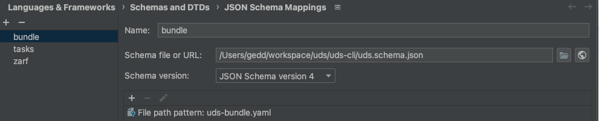

## Schema Validation

When working with UDS Bundle definitions it can be useful to setup your IDE to know about the schema that UDS Runner uses.

### VS Code

To do this in VS Code you can install the [YAML Extension](https://marketplace.visualstudio.com/items?itemName=redhat.vscode-yaml) and add the following to your `settings.json` (pinning `main` to your UDS CLI version if desired):

```json
    "yaml.schemas": {
        "https://raw.githubusercontent.com/defenseunicorns/uds-cli/main/uds.schema.json": "uds-bundle.yaml"
    },
```

You can also add the following line to the top of a yaml file as well:

```yaml
# yaml-language-server: $schema=https://raw.githubusercontent.com/defenseunicorns/uds-cli/main/uds.schema.json
```

### Goland (Jetbrains IDEs)

There are 2 methods for performing schema validation in Jetbrains IDEs.

#### 1. File Header (recommended)
Alternatively, you can add the following line to the top of a YAML file:


For `uds-bundle.yaml`
```yaml
# yaml-language-server: $schema=https://raw.githubusercontent.com/defenseunicorns/uds-cli/main/uds.schema.json
```

For `zarf.yaml`
```yaml
# yaml-language-server: $schema=https://raw.githubusercontent.com/defenseunicorns/uds-cli/main/zarf.schema.json
```

For `tasks.yaml`
```yaml
# yaml-language-server: $schema=https://raw.githubusercontent.com/defenseunicorns/uds-cli/main/tasks.schema.json
```

#### 2. IDE Settings
Use this method if you want to apply the schema to all YAML files in your project without modifying them. Open the IDE settings and navigate to `Languages & Frameworks` -> `Schemas and DTDs` -> `JSON Schema Mappings` and add a new schema using the "+" icon as shown below:



Don't forget to set the file path pattern for the JSON schema to apply to.
